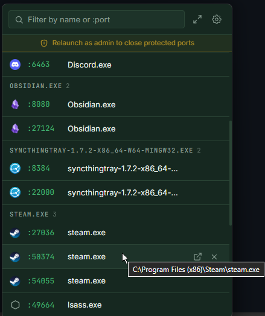

# port-star

Windows system-tray utility that shows every listening TCP port with its process name, icon, and a kill button.



## What it does

- Click the tray icon to open a compact frameless popover anchored at your cursor
- Each row: app icon, port number, process name, open-in-browser button, kill button
- Search bar filters live by name or `:port`
- **Kill matching** — kills every row that survives the current filter in one click
- **Pop out** — converts the popover to a normal resizable window with a taskbar entry
- Shield badge on rows that require elevation to kill; one-click **Relaunch as admin** flow for a single UAC prompt
- Settings: launch at startup, start elevated (via Task Scheduler), quit

## Stack

Tauri 2 (Rust) + Svelte 5 + TypeScript. Windows only.

## Requirements

- [Node.js](https://nodejs.org/) 18+
- [pnpm](https://pnpm.io/) 8+
- [Rust](https://www.rust-lang.org/tools/install) stable (via rustup)

## Dev

```sh
pnpm install
pnpm tauri dev
```

First Rust build takes a few minutes; incremental rebuilds are ~10s.
## Build

```sh
pnpm tauri build
```

Outputs in `src-tauri/target/release/bundle/`:
- `msi/port-star_0.1.0_x64_en-US.msi`
- `nsis/port-star_0.1.0_x64-setup.exe`

## License

[MIT](LICENSE)
